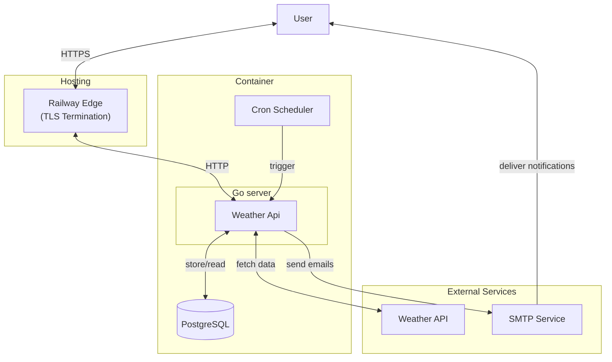

# System Software Design: Weather subscription service

## 1. System Requirements

### 1.1. Functional Requirements
- **Weather Retrieval:** Fetch current weather and forecasts for a given city from a third-party API.
- **Subscription Management**:
  
  - Allow users to subscribe to weather updates by email (```POST /subscribe```)
  - **Support frequency selection:** hourly or daily updates.
  - Send a confirmation email containing a unique ```token``` upon subscription
  - Confirm subscriptions via ```GET /confirm?token=<token>```
  - Prevent duplicate subscriptions (unique combination of email and city).
  - Allow users to unsubscribe via ```GET /unsubscribe?token=<token>```.
- **Automated Notifications:**
  
  - Schedule and send weather update emails according to user-selected frequency. 
  - Include city-specific weather data in each email.
- **User Interface:**

    - Provide a simple web interface for users to subscribe, confirm, and unsubscribe.

### 1.2. Non-Functional Requirements

- **Availability:** The service should be available 99.9% of the time.
- **Scalability:** The system should handle up to 10,000 concurrent users.
- **Performance:** Weather updates should be sent within 2 minutes of the scheduled time.
- **Security:** 
  - Use HTTPS for all communications.
  - Store user data securely, encrypt sensitive information.
  - Validate and sanitize inputs (email, city, tokens).
- **Latency:** API responses should be under 200ms for weather data retrieval.
- **Maintainability:** Modular code structure with clear separation of concerns.
- **Data Integrity:** Ensure no duplicate subscriptions and handle errors gracefully.
- **Testability:** Provide unit and integration tests for critical components.

### 1.3. Constraints

- **Budget:** Cost-effective solution, preferably using open-source technologies.
- **Weather API Limitation:** 1_000_000 requests per month ([weatherapi](https://www.weatherapi.com/))
- **Email Limits:** Adhere to SMTP provider limits.
- **Deployment:** Single-instance deployment initially; vertical scaling.
- **Hosting:** [Railway](https://railway.com/) with pricing 5$/month.

## 2. Traffic Estimation

- **Initial User Base:** 3,000 users
- **Growth Rate:** 10% per month
- **Peak Concurrent Users:** 10,000 users
- **Email Frequency:**
  - **Daily Updates:** 50% of users
  - **Hourly Updates:** 30% of users
  - **No Updates:** 20% of users
  - **Average Emails Sent per Day:**
    - Daily: 1,500+ users * 1 email = 1,500+ emails
    - Hourly: 900+ users * 24 emails = 21,600+ emails
    - Total: **23,100+ emails/day**

## 3. System Design
### 3.1. High-Level Architecture


### 3.2. Domain Layer

- **Domain Services:**
  - **Weather:** handles weather data retrieval from the external API.
  - **Subscription:** manages user subscriptions, including creation, confirmation, and unsubscription.
  - **Scheduler:** responsible for scheduling and sending email notifications.
- **Entities:**
  - ```Subscription``` id, email, city, frequency, confirmed, tokens, CreatedAt 
  - ```Weather``` humidity, temperature, description

### 3.3. Infrastructure Layer

- **Database:** PostgreSQL for storing user. Migrations in ```migrations/```.
- **Weather API Client:** A client to interact with the external weather API.
- **Email Service:** SMTP service for sending emails.
- **Configuration:** environment variables via ```.env```.
- **Docker:** Containerization for easy deployment and scaling.
- **CI/CD:** GitHub Actions for automated testing and deployment.

### 3.4. API Endpoints

[**Swagger documentation**](/docs/swagger.yaml)

- ```POST /subscribe```
  - Request: JSON with email, city, frequency.
  - Response: Confirmation email sent with a unique token.
- ```GET /confirm/<token>```
  - Request: Token to confirm subscription.
  - Response: Confirmation success or failure.
- ```GET /unsubscribe/<token>```
  - Request: Token to unsubscribe.
  - Response: Unsubscription success or failure.
- ```GET /weather?city=<city>```
  - Request: City name to fetch weather data.
  - Response: Current weather data for the specified city.


## 4. Deployment Strategy

- **Containerization:** Docker for consistent deployment across environments.
- **Hosting:** Railway for initial deployment, from docker image.
- **Environments:** 
  - **Development:** Local environment with Docker Compose.
  - **Production:** Railway production environment.
- **CI/CD:** GitHub Actions for build, test, lint, deploy.
- **Database Migrations:** Automated at startup using ```golang-migrate```.

## 5. Future Enhancements

 - **Asynchronous Processing:** Message broker (Kafka/RabbitMQ) for email jobs.
 - **Rate Limiting:** Implement rate limiting for API requests to prevent abuse.
 - **Advanced Caching:** Redis for weather data and request rate limits. 
 - **User Preferences:**
   - Allow users to set preferences for weather data (e.g., units, additional data).
   - Support region-based or geolocation subscriptions.
   - Allow custom intervals beyond hourly/daily.
 - **Scalable Architecture:** Microservices architecture for better scalability and maintainability.
 - **UI Improvements:** Interactive front-end
 - **Admin Dashboard:** For managing subscriptions, monitoring system health, and analytics.
 - **Analytics:** Track user engagement, subscription trends, and system performance.
 - **Authentication:** Implement user authentication for a personalized experience.
 - **Testing:** Comprehensive unit and integration tests for all components.
 - **Separate Migration CLI:** For managing database migrations separately from the main application.

