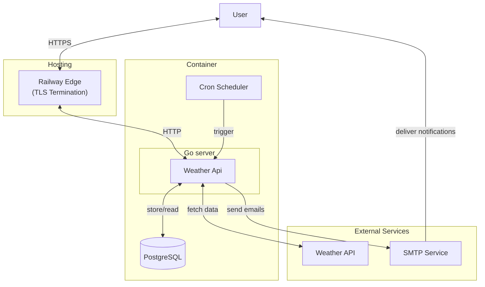

# System Software Design: Weather subscription service

## 1. System Requirements

### 1.1. Functional Requirements
- **Weather Retrieval:** Fetch current weather and forecasts for a given city from a third-party API.
- **Subscription Management**:
  
  - Allow users to subscribe to weather updates by email (```POST /subscribe```)
  - **Support frequency selection:** hourly or daily updates.
  - Send a confirmation email containing a unique ```token``` upon subscription
  - Confirm subscriptions via ```GET /confirm?token=<token>```
  - Prevent duplicate subscriptions (unique combination of email and city).
  - Allow users to unsubscribe via ```GET /unsubscribe?token=<token>```.
- **Automated Notifications:**
  
  - Schedule and send weather update emails according to user-selected frequency. 
  - Include city-specific weather data in each email.
- **User Interface:**

    - Provide a simple web interface for users to subscribe, confirm, and unsubscribe.

### 1.2. Non-Functional Requirements
### Service Availability
| Category     | SLI                                                                                                                                                                                                                                                                                                                                        | SLO          |
|--------------|--------------------------------------------------------------------------------------------------------------------------------------------------------------------------------------------------------------------------------------------------------------------------------------------------------------------------------------------|--------------|
| Availability | The proportion of successful service requests or uptime. <br> `(Total uptime / Total observation period) * 100%` <br><br> **How to read parameters:** <br> - `Total uptime`: The cumulative time the service was fully operational and available. <br> - `Total observation period`: The total duration over which the uptime is measured. | 99.9% uptime |

### System Scalability
| Category         | SLI                                                                                                                                                                                                                                                                                                                                                                              | SLO                     |
|------------------|----------------------------------------------------------------------------------------------------------------------------------------------------------------------------------------------------------------------------------------------------------------------------------------------------------------------------------------------------------------------------------|-------------------------|
| Concurrent Users | The maximum number of concurrent active users the system can effectively handle without performance degradation. <br> `Measured by peak concurrent active sessions/connections.` <br><br> **How to read parameters:** <br> - `Peak concurrent active sessions/connections`: The highest recorded number of users simultaneously interacting with the system at any given moment. | 10,000 concurrent users |

### Performance (Weather Updates)
| Category             | SLI                                                                                                                                                                                                                                                                                                                                                                                                                                                                     | SLO                                                                                         |
|----------------------|-------------------------------------------------------------------------------------------------------------------------------------------------------------------------------------------------------------------------------------------------------------------------------------------------------------------------------------------------------------------------------------------------------------------------------------------------------------------------|---------------------------------------------------------------------------------------------|
| Update Delivery Time | The time difference between the scheduled update time and the actual update delivery time. <br> `Time_actual_delivery - Time_scheduled` <br><br> **How to read parameters:** <br> - `Time_actual_delivery`: The exact timestamp when the weather update was successfully sent to the user. <br> - `Time_scheduled`: The predetermined timestamp when the weather update was supposed to be sent. <br> - `Time_difference`: The calculated delay or early delivery time. | Updates delivered within 2 minutes of scheduled time (i.e., `Time_difference <= 2 minutes`) |

### Security
| Category                        | SLI                                                                                                                                                                                                                                                                                                                                                                                                                                                                                            | SLO                                                          |
|---------------------------------|------------------------------------------------------------------------------------------------------------------------------------------------------------------------------------------------------------------------------------------------------------------------------------------------------------------------------------------------------------------------------------------------------------------------------------------------------------------------------------------------|--------------------------------------------------------------|
| HTTPS Usage                     | The proportion of communications using HTTPS. <br> `(Count of HTTPS requests / Total requests) * 100%` <br><br> **How to read parameters:** <br> - `Count of HTTPS requests`: The number of data exchanges or connections that were secured using the HTTPS protocol. <br> - `Total requests`: The total number of all communications or connections, regardless of protocol.                                                                                                                  | 100% HTTPS for all communications                            |
| Sensitive Data Encryption       | The proportion of sensitive user data stored encrypted. <br> `(Count of encrypted sensitive data records / Total sensitive data records) * 100%` <br><br> **How to read parameters:** <br> - `Count of encrypted sensitive data records`: The number of individual pieces or records of sensitive user data that have been processed with encryption. <br> - `Total sensitive data records`: The total number of all sensitive user data records stored in the system.                         | 100% of sensitive user data encrypted                        |
| Input Validation & Sanitization | The proportion of inputs successfully validated and sanitized. <br> `(Count of valid & sanitized inputs / Total inputs) * 100%` <br><br> **How to read parameters:** <br> - `Count of valid & sanitized inputs`: The number of user-provided data inputs (like email, city, tokens) that have passed all validation rules and have had potentially harmful characters removed or neutralized. <br> - `Total inputs`: The total number of all user-provided data inputs received by the system. | 100% of inputs (email, city, tokens) validated and sanitized |

### Latency (API Responses)
| Category              | SLI                                                                                                                                                                                                                                                                                                                                                                                                                                                                                                                                                                                                                              | SLO                              |
|-----------------------|----------------------------------------------------------------------------------------------------------------------------------------------------------------------------------------------------------------------------------------------------------------------------------------------------------------------------------------------------------------------------------------------------------------------------------------------------------------------------------------------------------------------------------------------------------------------------------------------------------------------------------|----------------------------------|
| API Response Latency  | The proportion of API responses for weather data retrieval that are under a specified duration. <br> `count of "weather_api" http_responses with a duration less than or equal to "0.2" seconds divided by count of all "weather_api" http_responses` <br><br> **How to read parameters:** <br> - `count of "weather_api" http_responses`: The total number of responses received from the weather data API. <br> - `duration less than or equal to "0.2" seconds`: The time taken for an API request to complete its round trip, with "0.2 seconds" (200 milliseconds) being the maximum acceptable time for a "fast" response. | 98% of API responses under 200ms |

### Maintainability
| Category                      | SLI                                                                                                                                                                                                                                                                                                                                                                                                                                                              | SLO                                                                                   |
|-------------------------------|------------------------------------------------------------------------------------------------------------------------------------------------------------------------------------------------------------------------------------------------------------------------------------------------------------------------------------------------------------------------------------------------------------------------------------------------------------------|---------------------------------------------------------------------------------------|
| **Code Formatting & Linting** | **Percentage of code files passing static analysis checks (e.g., using golangci-lint).** <br> `(Count of files passing checks / Total files) * 100%` <br><br> **How to read parameters:** <br> - **Files:** All source code files in the project. <br> - **Passing checks:** Files comply with configured formatting and linting rules. <br> - **Static analysis tools:** Automated tools (like golangci-lint) used to enforce code quality and style standards. | **100% code adherence to static analysis standards (zero reported errors/warnings).** |

### Data Integrity
| Category                    | SLI                                                                                                                                                                                                                                                                                                                                                                                                                                                                                                                                                                                                                                                                                                                                                                                                                                | SLO                               |
|-----------------------------|------------------------------------------------------------------------------------------------------------------------------------------------------------------------------------------------------------------------------------------------------------------------------------------------------------------------------------------------------------------------------------------------------------------------------------------------------------------------------------------------------------------------------------------------------------------------------------------------------------------------------------------------------------------------------------------------------------------------------------------------------------------------------------------------------------------------------------|-----------------------------------|
| Duplicate Subscriptions     | **Absence of subscription conflicts where a user attempts to subscribe to the same service multiple times, or where multiple users share the same unique identifier.** <br> `Count of unique identifier conflicts OR Count of duplicate subscription attempts for an active subscription.` <br><br> **How to read parameters:** <br> - **Unique identifier conflicts:** Instances where the system detects two or more distinct user accounts assigned the same unique identifier (e.g., user ID, email address, if email is intended to be unique across users). <br> - **Duplicate subscription attempts:** Instances where a user (identified uniquely) tries to subscribe to a service they are already actively subscribed to. This indicates a data integrity issue if the system allows it or doesn't gracefully handle it. | 0 duplicate subscriptions         |
| Error Handling Gracefulness | Proportion of errors handled gracefully without system failure or data corruption. <br> `(Count of gracefully handled errors / Total errors) * 100%` <br><br> **How to read parameters:** <br> - **Gracefully handled errors:** Errors that did not lead to crashes, data loss, or significant negative user impact. <br> - **Total errors:** All detected errors/exceptions.                                                                                                                                                                                                                                                                                                                                                                                                                                                      | 100% of errors handled gracefully |

### Testability
| Category                      | SLI                                                                                                                                                                                                                                                                                                                                                                                                                                                                                                                | SLO                                                           |
|-------------------------------|--------------------------------------------------------------------------------------------------------------------------------------------------------------------------------------------------------------------------------------------------------------------------------------------------------------------------------------------------------------------------------------------------------------------------------------------------------------------------------------------------------------------|---------------------------------------------------------------|
| Code Coverage (Unit Tests)    | The percentage of critical code covered by unit tests. <br> `(Lines of code covered by unit tests / Total lines of critical code) * 100%` <br><br> **How to read parameters:** <br> - `Lines of code covered by unit tests`: The number of lines of source code that are executed by the automated unit tests. <br> - `Total lines of critical code`: The total number of lines of code identified as essential for the core functionality and stability of the system.                                            | **90%** coverage for critical components                      |
| Integration Test Success Rate | The proportion of successful integration tests. <br> `(Count of passing integration tests / Total integration tests) * 100%` <br><br> **How to read parameters:** <br> - `Count of passing integration tests`: The number of integration tests that executed without errors and confirmed the correct interaction between different system modules or services. <br> - `Total integration tests`: The total number of integration tests designed to verify end-to-end functionality or inter-module communication. | **100%** successful integration tests for critical components |

### 1.3. Constraints

- **Budget:** Cost-effective solution, preferably using open-source technologies.
- **Weather API Limitation:** 1_000_000 requests per month ([weatherapi](https://www.weatherapi.com/))
- **Email Limits:** Adhere to SMTP provider limits.
- **Deployment:** Single-instance deployment initially; vertical scaling.
- **Hosting:** [Railway](https://railway.com/) with pricing 5$/month.

## 2. Traffic Estimation
### User Base & Engagement

| Category              | SLI                                                                                                                                                   | SLO           |
|-----------------------|-------------------------------------------------------------------------------------------------------------------------------------------------------|---------------|
| Initial User          | **Current number of users at project start.** <br> **How to read:** *Initial count of registered and active users at defined starting point.*         | 3,000 users   |
| Growth Rate           | **Monthly percentage increase in user count.** <br> **How to read:** *( (Current Month Users - Previous Month Users) / Previous Month Users ) * 100%* | 10% per month |
| Peak Concurrent Users | **Maximum number of users active simultaneously.** <br> **How to read:** *Find maximum distinct active user sessions at any moment in a period.*      | 10,000 users  |

### Email Frequency

| Category                    | SLI                                                                                                                                                      | SLO                                                |
|-----------------------------|----------------------------------------------------------------------------------------------------------------------------------------------------------|----------------------------------------------------|
| Daily Updates               | **Percentage of users receiving daily emails.** <br> **How to read:** `(count of users subscribed to daily updates / total active users) * 100%`         | *>* 50% of users                                   |
| Hourly Updates              | **Percentage of users receiving hourly emails.** <br> **How to read:** `(count of users subscribed to hourly updates / total active users) * 100%`       | *>* 30% of users                                   |
| No Updates                  | **Percentage of users receiving no email updates.** <br> **How to read:** `(count of users opted out of all updates / total active users) * 100%`        | *<* 20% of users                                   |
| Average Emails Sent per Day | **Total daily emails dispatched to users.** <br> **How to read:** `(count of daily update users * 1 email) + (count of hourly update users * 24 emails)` | 23,100+ emails/day (1,500+ daily + 21,600+ hourly) |


## 3. System Design
### 3.1. High-Level Architecture


### 3.2. Domain Layer

- **Domain Services:**
  - **Weather:** handles weather data retrieval from the external API.
  - **Subscription:** manages user subscriptions, including creation, confirmation, and unsubscription.
  - **Scheduler:** responsible for scheduling and sending email notifications.
- **Entities:**
  - ```Subscription``` id, email, city, frequency, confirmed, tokens, CreatedAt 
  - ```Weather``` humidity, temperature, description

### 3.3. Infrastructure Layer

- **Database:** PostgreSQL for storing user. Migrations in ```migrations/```.
- **Weather API Client:** A client to interact with the external weather API.
- **Email Service:** SMTP service for sending emails.
- **Configuration:** environment variables via ```.env```.
- **Docker:** Containerization for easy deployment and scaling.
- **CI/CD:** GitHub Actions for automated testing and deployment.

### 3.4. API Endpoints

[**Swagger documentation**](/docs/swagger.yaml)

- ```POST /subscribe```
  - Request: JSON with email, city, frequency.
  - Response: Confirmation email sent with a unique token.
- ```GET /confirm/<token>```
  - Request: Token to confirm subscription.
  - Response: Confirmation success or failure.
- ```GET /unsubscribe/<token>```
  - Request: Token to unsubscribe.
  - Response: Unsubscription success or failure.
- ```GET /weather?city=<city>```
  - Request: City name to fetch weather data.
  - Response: Current weather data for the specified city.


## 4. Deployment Strategy

- **Containerization:** Docker for consistent deployment across environments.
- **Hosting:** Railway for initial deployment, from docker image.
- **Environments:** 
  - **Development:** Local environment with Docker Compose.
  - **Production:** Railway production environment.
- **CI/CD:** GitHub Actions for build, test, lint, deploy.
- **Database Migrations:** Automated at startup using ```golang-migrate```.

## 5. Future Enhancements

 - **Asynchronous Processing:** Message broker (Kafka/RabbitMQ) for email jobs.
 - **Rate Limiting:** Implement rate limiting for API requests to prevent abuse.
 - **Advanced Caching:** Redis for weather data and request rate limits. 
 - **User Preferences:**
   - Allow users to set preferences for weather data (e.g., units, additional data).
   - Support region-based or geolocation subscriptions.
   - Allow custom intervals beyond hourly/daily.
 - **Scalable Architecture:** Microservices architecture for better scalability and maintainability.
 - **UI Improvements:** Interactive front-end
 - **Admin Dashboard:** For managing subscriptions, monitoring system health, and analytics.
 - **Analytics:** Track user engagement, subscription trends, and system performance.
 - **Authentication:** Implement user authentication for a personalized experience.
 - **Testing:** Comprehensive unit and integration tests for all components.
 - **Separate Migration CLI:** For managing database migrations separately from the main application.

